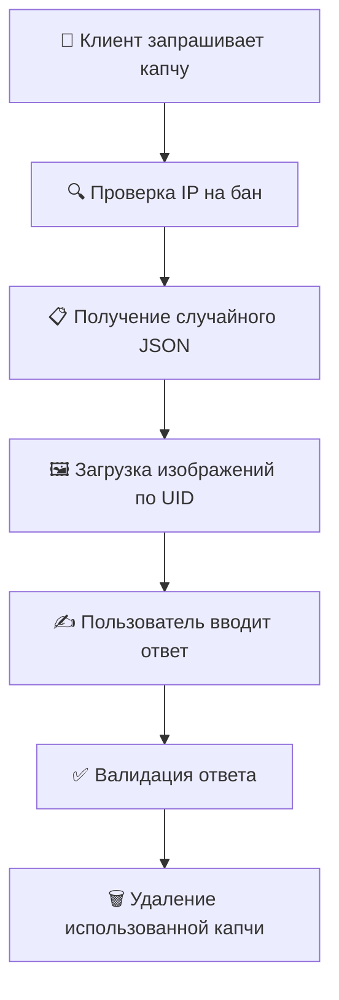

# 🛡️ Интеллектуальная CAPTCHA система

## 📋 Обзор проекта

Это продвинутая система CAPTCHA с двухуровневой проверкой, реализованная на Python и Lua. Система генерирует математические задачи с визуальными элементами (SVG иконки) и обеспечивает высокий уровень защиты от ботов и автоматизированных атак.

## 🎯 Что это такое?

**Интеллектуальная CAPTCHA** — это система верификации пользователей, которая:

- 🎨 Генерирует уникальные визуальные задачи с цветными иконками
- 🔢 Создает математические примеры (сложение, вычитание, умножение)
- 🌐 Поддерживает русский язык в вопросах
- 🔒 Обеспечивает многоуровневую защиту от обхода
- ⚡ Автоматически удаляет истекшие капчи

## 🔧 Архитектура системы

### Основные компоненты:

```
📁 backend/
├── 🐍 generator/          # Python-генератор капчи
│   ├── generator.py       # Основной генератор
│   ├── params_pool.py     # Банк иконок и параметров
│   ├── utils.py           # Утилиты обработки изображений
│   └── config.py          # Конфигурация
├── 🌙 server/             # Lua HTTP-сервер
│   ├── main.lua           # API endpoints
│   └── utils.lua          # Серверные утилиты
└── 🗂️ captchas/           # Хранилище сгенерированных капчи
    ├── image/             # Основные изображения капчи
    ├── ask/               # Изображения вопросов
    └── numbers/           # Изображения чисел
```

## 🚀 Как это работает?

### Процесс генерации:

1. **🎲 Случайный выбор элементов**
   - Выбираются 3 случайные иконки из 100+ доступных
   - Выбираются 2 цвета из палитры
   - Генерируется математическая операция

2. **🎨 Создание изображения**
   - SVG иконки размещаются случайно на холсте
   - Применяются повороты и масштабирование
   - Добавляется случайный фон с эффектами размытия

3. **📝 Формирование вопроса**
   - Создается текст на русском языке
   - Пример: "Результат сложения зеленых самолетов и красных мячей"

### Процесс верификации:



## 🔐 Система безопасности

### Двухуровневая защита DOM:

1. **Первый уровень**: Проверка существования элемента через `document.querySelector()`
2. **Второй уровень**: Сравнение с React ref через `isEqualNode()`

### Дополнительные меры:

- 🚫 **Система банов** по IP
- ⏰ **Автоистечение капчи** через 90 секунд
- 🔄 **Рикроллинг** при попытках обхода
- 📊 **Ограничение попыток** (4 неудачные попытки = бан)

## 🏃‍♂️ Быстрый старт

### Предварительные требования:

- Docker & Docker Compose
- Nginx (для продакшена)

### Запуск:

```bash
# 1. Клонирование и запуск
git clone <repository>
cd captcha-system
docker compose up -d --build

# 2. Настройка Nginx
# Добавить в конфигурацию Nginx блок из nginx/templates/default.conf.template
```

## 📊 Характеристики системы

| Параметр | Значение |
|----------|----------|
| 🎨 Иконки | 100+ уникальных SVG |
| 🌈 Цвета | 7 основных цветов |
| 🔢 Операции | +, -, × |
| ⏱️ Время жизни | 90 секунд |
| 🚫 Попытки | 4 максимум |
| 🌐 Язык | Русский |

## 📝 API Endpoints

### Основные маршруты:

```http
GET /captcha/get_captcha/:ip
# Получение новой капчи

GET /captcha/get_numbers_image/:uid/:ip
# Загрузка изображения с числами

GET /captcha/get_ask_image/:uid/:numbers/:ip
# Загрузка изображения вопроса

GET /captcha/get_captcha_image/:uid/:numbers/:ip
# Загрузка основного изображения капчи

GET /captcha/validate_captcha/:uid/:answer/:ip
# Валидация ответа капчи

GET /captcha/validate_numbers/:uid/:numbers/:ip
# Валидация чисел
```

## 🔧 Настройка и конфигурация

### Основные параметры в `config.py`:

```python
# Размеры изображений
captcha_w, captcha_h = 250, 145  # Основная капча
numbers_w, numbers_h = 100, 100  # Числа
ask_w = 250                      # Вопрос

# Параметры иконок
min_icon_count = 8               # Минимум иконок
max_icon_count = 12              # Максимум иконок
icon_sample_size = 3             # Количество типов иконок
color_sample_size = 2            # Количество цветов
```

## 🎯 Применение

Идеально подходит для:

- 🌐 **Веб-сайтов** с высокими требованиями к безопасности
- 🛒 **E-commerce платформ** 
- 💰 **Финансовых сервисов**
- 🎮 **Игровых платформ**
- 📧 **Систем регистрации**

## 🔍 Мониторинг

Система включает:

- 📈 **Логирование всех попыток**
- 🔍 **Отслеживание подозрительной активности**
- 📊 **Статистика использования**
- ⚠️ **Автоматические уведомления о банах**

---

> 💡 **Совет**: Для максимальной эффективности рекомендуется настроить мониторинг логов и регулярно обновлять банк иконок для поддержания актуальности системы.

## 📞 Поддержка

При возникновении вопросов или проблем:
1. Проверьте логи Docker контейнеров
2. Убедитесь в корректности настройки Nginx
3. Проверьте доступность портов 3000

**Система готова к использованию и обеспечивает надежную защиту от автоматизированных атак!** 🚀
